# Project - Item Catalog
### Udacity Full Stack Nano Degree - Project #4  

## About
This project implements a catalog containing categories and associated items.  The application provides two methods provide authentication.  The first method is through a third-party provider.  The second method is by way of a simple user + password local method.  The third-party authentication used is by way of google.  

Any user can view categories and items; however, to add, modify, or delete, the user must be authenticated.  Also, to modify or delete a category, the user must be the owner/creator of the item.  

Some of the technologies used in this application include:
* Flask 
* Bootsrap
* Jinja2
* SQLite

## Prerequisites
In order to install and execute, download or install the following:
* [Virtual Box](https://www.virtualbox.org/wiki/Downloads)
* [Install vagrant](https://www.vagrantup.com/)
* [Clone this repository](https://github.com/jcarter62/udacity-item-catalog.git)

## Installing
* Clone the repository listed above
* open a command line and change current directory to where you cloned the repository.
* perform _vagrant up_, and wait for a command prompt to return.
* perform _vagrant ssh_
* cd /vagrant/catalog
* execute _python app.py_
* open browser, and visit [http://localhost:8000](http://localhost:8000)
* if first time running, login in order to add categories or items.

## Walkthrough Images

Startup 
Notice no add category or item buttons, because user is not logged in.
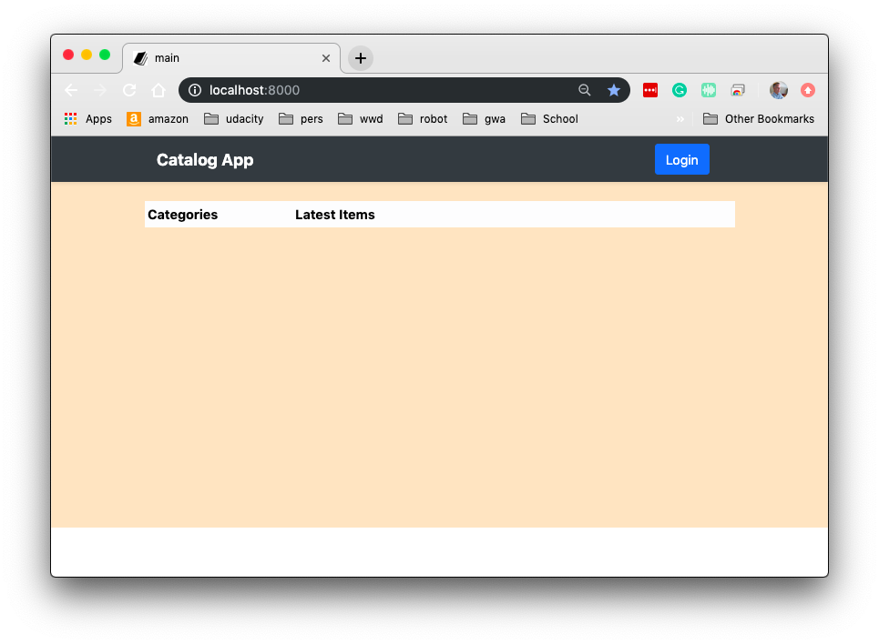

Login
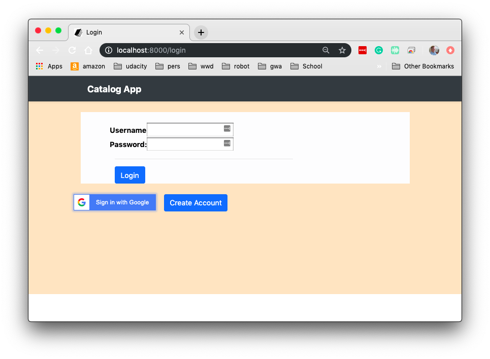

Google Auth dialog if user chooses google login method.
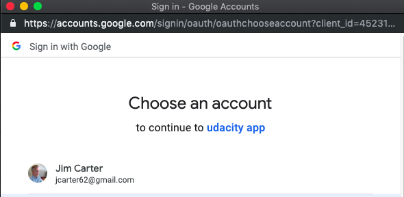

Home/Startup dialog after login completed.  Notice the buttons available and the user's name and image.
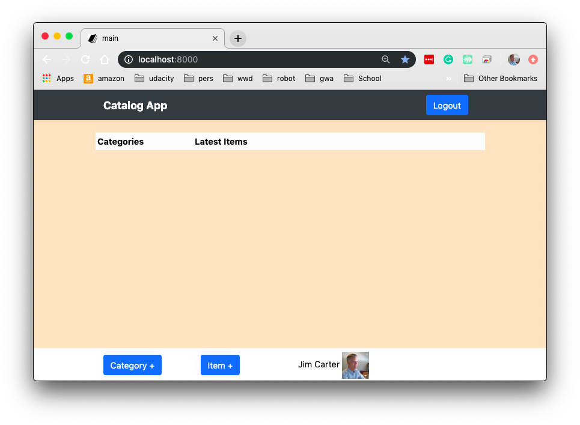

Add Category
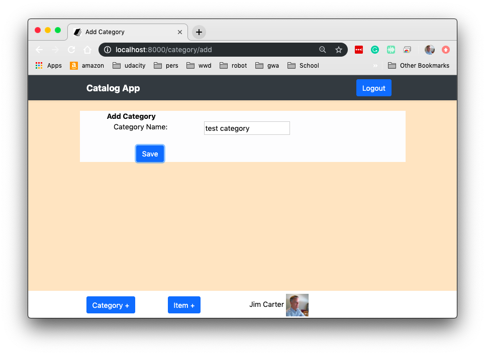

Add Item1
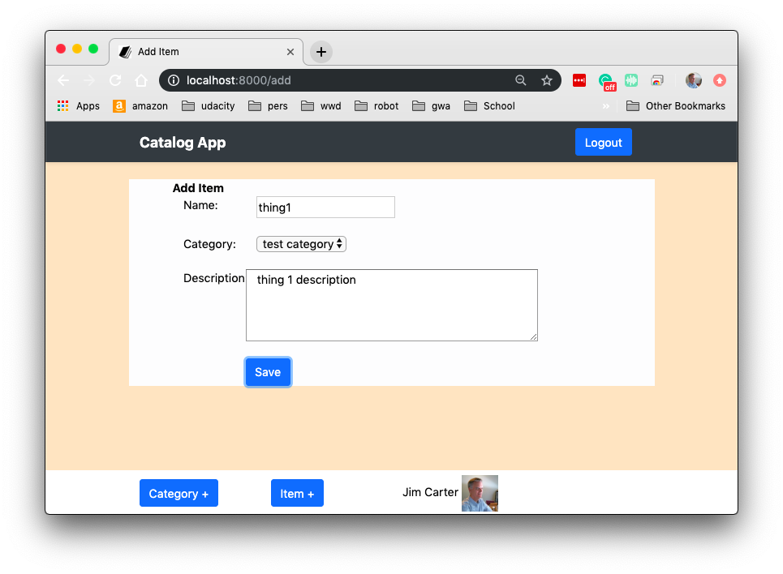

Add Item2
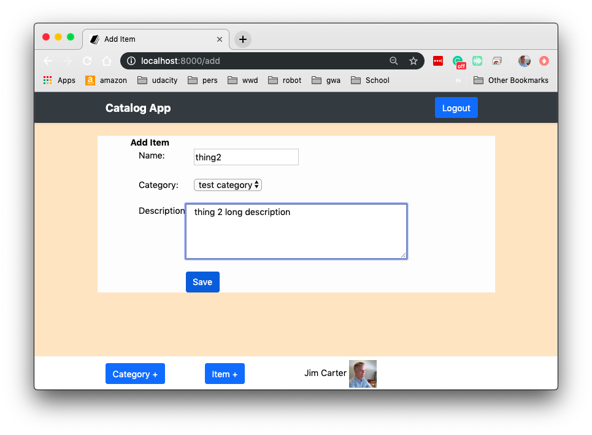

Item List
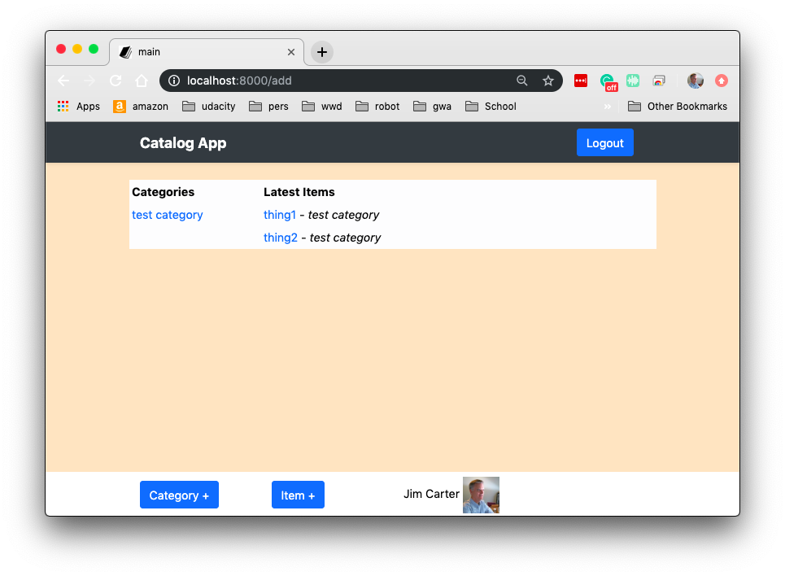

Logout Dialog
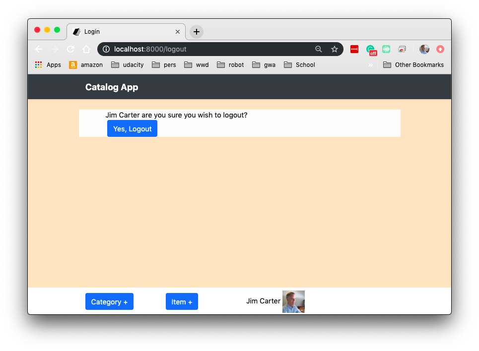

Item Modification Limit when user is not logged in
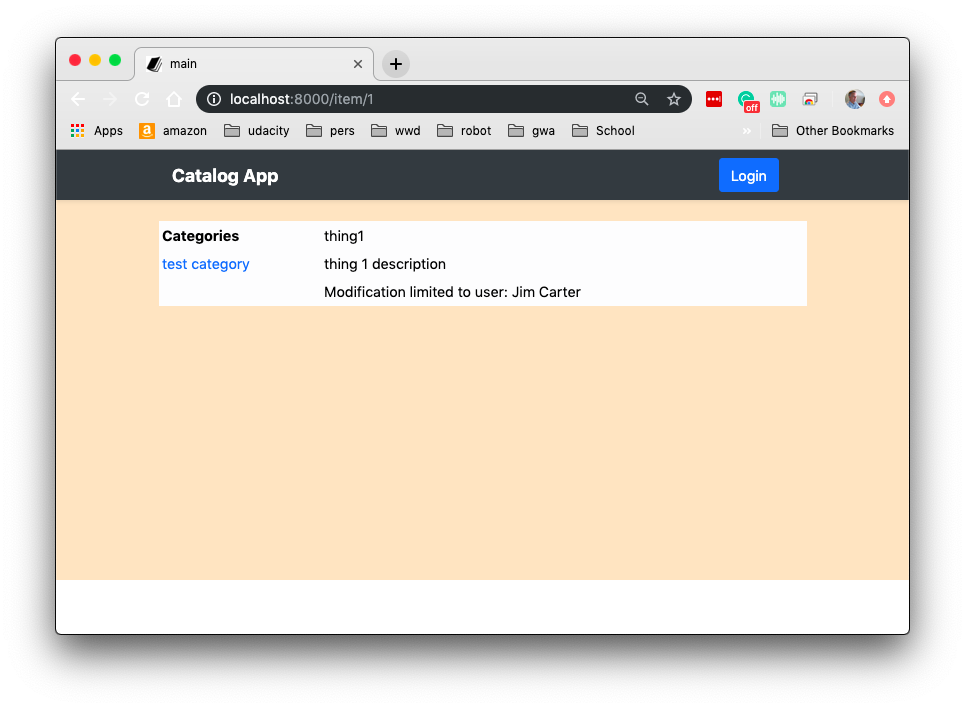

Item Edit Dialog
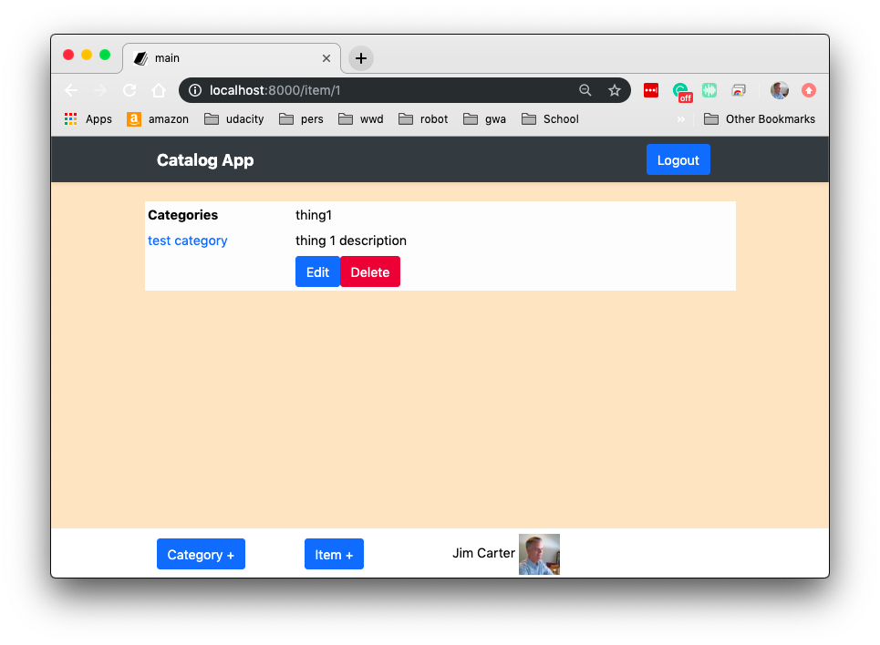

Item Save Dialog

Item Delete Dialog
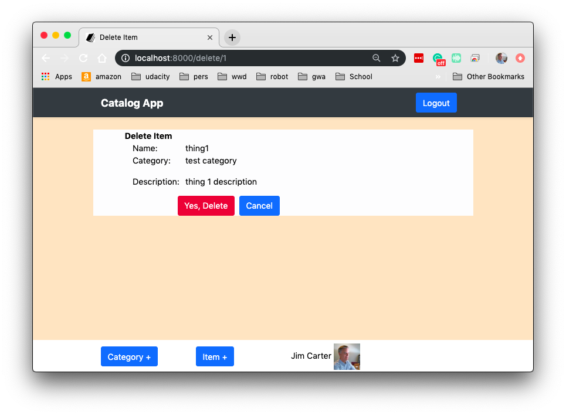

## Available API calls
There are 3 main api endpoints available to users.
- /api/v1/catalog:  This returns a list of categories and associated items.
- /api/v1/categories  This returns a list of all categories.  
- /api/v1/categories/**category-name**  Returns one category where name=**category-name** record if found.
- /api/v1/items Returns a list of all items in database.
- /api/v1/items/**item-id** Returns one item record where item id=**item-id**.

## Authors
Jim Carter

## License
This project is licensed under the MIT License

